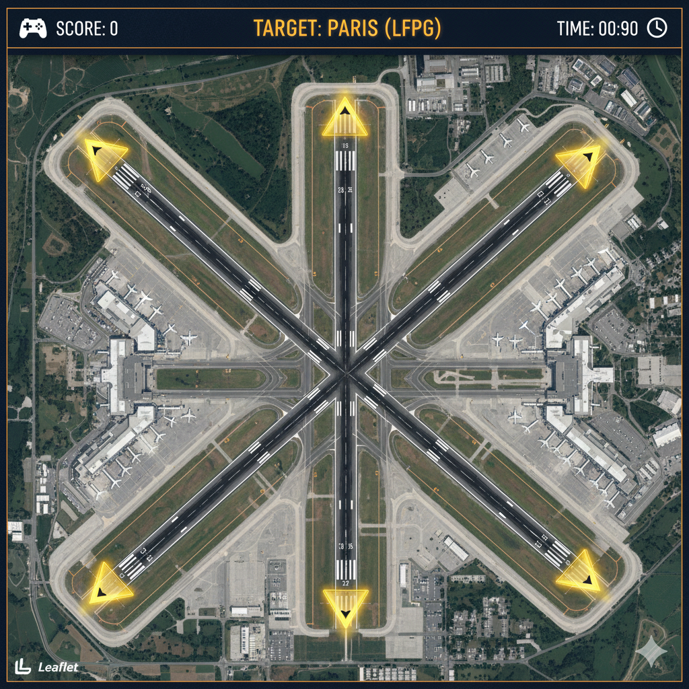

✈️ Ready for Departure ✈️

This project is being developed as part of the GMT 458 Web GIS course's "Assignment 2: GeoGame." It is an aviation-themed, pilotage and geographic orientation-based runway selection game.

1. Game Requirements & Flow
🎮 Game Progression
The game is designed as a fast-paced, time-sensitive challenge.

Gameplay:

The user is presented with an interactive Leaflet map displaying the runways of a specific airport (e.g., a sample airport with varied runway orientations) on a satellite imagery base map.

A target airport name (e.g., "TARGET: PARIS (LFPG)") appears at the top of the screen. This target is not visually marked on the map (not decided yet).

The player must determine the geographic direction of the given target (e.g., Paris = Northwest) and then click on the most appropriate runway arrow polygon on the map for a departure towards that direction.

❓ Number of Questions
There is no fixed number of questions. The user attempts to complete as many "runway selection" tasks as possible within the given time limit.

🏆 Scoring (High-Score)
The objective of the game is to achieve the highest score within the game's duration.

Point values for correct/incorrect answers: Not decided yet.

Total game duration: Not decided yet.

❤️ Player Lives
There is no "lives" system in the game. Penalization occurs through score deduction for incorrect answers and the inherent time loss.

2. Planned JavaScript Libraries
This project will utilize a fundamental geographic mapping library and an advanced geospatial analysis library, which qualifies for bonus points in the assignment.

Leaflet.js: 🗺️ Will be used to display the base map (OpenStreetMap or satellite imagery) and to visualize the runways as clickable Polygon layers.

Turf.js: 📊  This will be the "advanced analysis engine" and the logical core of the game.

It will enable the game to determine the "single correct answer" for each target. In the background, turf.bearing() function will calculate the initial bearing (azimuth) from the departure airport (e.g., the sample airport) to the target airport (e.g., LFPG).

Based on this bearing, the game will identify which directional runway (e.g., North-facing, South-facing, East-facing, West-facing) corresponds to the correct departure path.

3. Frontend Layout (User Interface Design)
The user interface will be clean, aviation-themed, and primarily map-focused.

Header Bar (upper part)

Left Side (Score): Displays the current game score (e.g., "SCORE: 0").

Middle (Target): Shows the target airport for which the user must select a runway (e.g., "TARGET: PARIS (LFPG)"). This is the main question.

Right Side (Time): Displays a countdown timer for the remaining game time (e.g., "TIME: 00:90").

Main Map Area (main part):

An interactive Leaflet map covering the rest of the screen.

The map will be zoomed in on the satellite imagery of a sample airport with various runway orientations.

Clickable Runway Polygons: Each runway will feature arrow-shaped clickable polygons visually representing the available departure directions. The player selects their choice by clicking on the appropriate arrow polygon based on the target's direction.

